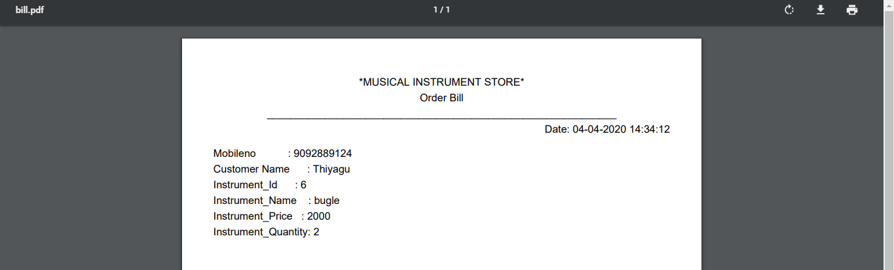

# Musical_Store_Excel
## About the Musical Store 
Which is fully based on Java and Excel project. Musical Store is mainly used for to maintain instruments in store.
Which is used to maintain sales and customers details in store. And then pdf billing system.
## Screenshot of bill

